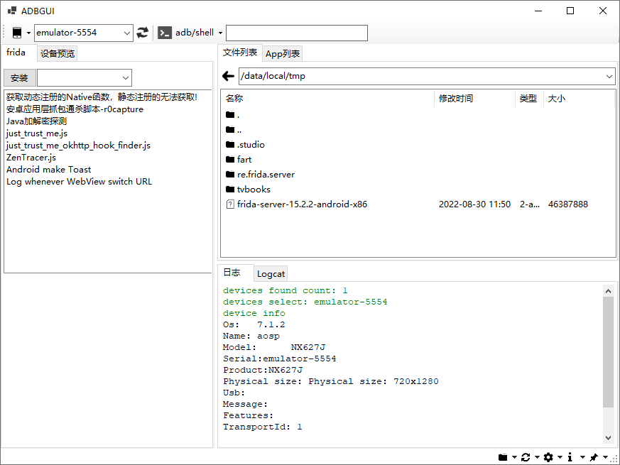

# ADBGUI
使用C#编写的GUI版ADB操作工具，方便高效。目前仅支持Windows64操作系统。

# 功能介绍

- adb常用命令集成
- shell常用命令集成
- 运行自动连接设备
- frida自动安装配置
- frida常用脚本管理
- 远程文件操作管理
- App安装列表管理
- 实时预览设备画面

## adb常用命令集成

见界面菜单列表，不再逐一列举。

## shell常用命令集成

见界面菜单列表，不再逐一列举。

- 代理相关的操作适合进行App网络抓包时使用，简单快捷。

## 运行自动连接设备

adbgui运行后自动识别并连接安卓设备，开发阶段均使用雷电模拟器进行测试，效果很好，真实设备没有试过。理论上支持多个设备的切换，由于没有真实设备，这个功能也没有具体测试过，如果有问题还请反馈。

## frida自动安装配置

frida的安装支持两种方式：

- 选择或指定版本安装：adbgui会自动从 [frida/releases](frida/releases) 下载、解压、推送操作。需要注意的是，如果网络环境访问GitHub很慢的话，不推荐该方式，会卡很久甚至会失败。
- 离线文件安装：适合访问GitHub很慢的情况，下载好需要的 frida-server 安装包进行离线安装，例如使用雷电模拟器是x86的CPU，则可以下载 [frida-server-15.2.2-android-x86.xz](https://github.com/frida/frida/releases/download/15.2.2/frida-server-15.2.2-android-x86.xz) ，下载好后的xz文件直接拖放到安装文本框，然后点 **安装** 按钮即可。

说明：

- 不输入任何frida的版本或离线文件的话，点击 **安装** 按钮会自动获取最近的 10 个 frida 版本供选择。
- 安装frida的时候需要先连接好安卓设备，adbgui需要推送 frida-server 文件到设备中，且推送的远程目录是：/data/local/tmp
- 可以在 远程文件管理列表里启动 frida-server，安装成功后只需要右键选中 frida-server 文件，运行之即可。adbgui退出后，frida-server 会自动退出，因此每次重新启动adbgui，需要使用frida时，需要手动启动 frida-server 一次。

## frida常用脚本管理

- 常用操作可以右键点击菜单查看。
- frida常用脚本的配置文件在 ./bin/frida.json，可以参考样式自动添加修改。修改完成后，只需要右键菜单选择重新加载即可生效。
- 支持已有脚本直接拖放进来添加，需要管理好相对路径，可以在拖放完成后查看下配置文件是否正确，不正确可以自己手动编辑下。

- 支持spawn方式、attach方式注入 js 脚本。

## 远程文件操作管理

这个不再赘述，可以自己操作体验下，都是一些常用的远程文件操作功能。

- 对于经常使用的目录，可以进行收藏，或者直接编辑 ./bin/favorite.txt 文件，一行一个目录路径，这个功能比较方便实用。
- 支持pull下载远程文件到本地。
- 上传文件直接拖放即可，方便快捷。

## App安装列表管理

默认显示的是用户级App安装列表，如果需要显示系统级的App列表，可以在 「设置」里进行配置。

- 复制包名
- 查看App安装包路径
- 提前App安装包文件
- 运行App
- 查看运行中的App信息
- 清除App缓存数据
- 发送广播：只内置了几个系统级别的广播，有待进一步完善。
- 性能测试-CPU/内存占用
- 性能测试-启动时间

## 实时预览设备画面

使用 [scrcpy](https://github.com/Genymobile/scrcpy) 实现实时预览手机画面的效果，配置方法：

- 从 [scrcpy/releases](https://github.com/Genymobile/scrcpy/releases ) 下载编译好的版本，例如下载 scrcpy-win64-v1.24.zip ，解压缩后修改修改文件夹名为 scrcpy-win64 放置在 adbgui/bin/tool目录下，adbgui会自动调用 ./bin/tool/scrcpy-win64/scrcpy.exe；
- 如果要升级替换 scrcpy 的版本，只需要替换 scrcpy-win64 目录下的文件即可，实现无缝升级；

说明：

- 目前实时预览画面仍然保留了 scrcpy 的边框，目的是为了实现跟随窗口的变化而变化，如果把边框去掉 scrcpy 的窗口大小在初始化后不会再变化，不太适合具体使用习惯。
- scrcpy 的操作是**右键点击返回**，这个还挺方便，第一次使用的人可能不知道，这里特别说明一下，scrcpy 还是很好用的。
